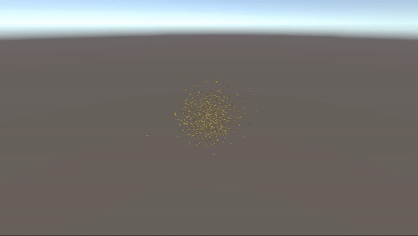

# Boids algorithm implementaion in Unity

## What is Boids algorithm?
Boids algorithm is an algorithm that tries to mimic the behavior and the movement of the bird flocks. It achieves this by using 3 simple rules: 
1. **Cohesion:** All the birds in the flock must move towards the center of mass of the flock
2. **Separation:** All the birds must move away from the other birds to avoid collision.
3. **Alignment:** all the birds must steer towards the average heading direction of the flock.

I have added a 4th rule: border avoidance to make the birds fly in a certain area.

By summing the vectors obtained from these 4 rules, the final movement direction of each bird can be calculated.
## How to use this project?
1. Clone this repository.
2. Open the project in Unity 2022.3.16 (Other versions are not tested but they might work).
3. Open `SampleScene` scene in the scenes folder.
4. Press play.

The `flock` game object has some settings:
* **Drone Number:** The number of drones to be spawned in the flock.
* **Drone Prefab:** The prefab of the drone to be spawned.
* **Flock Radius:** The radius of the area the birds are allowed to flay in.
* **Chesion Rule Weight:** The weight of the cohesion rule in the final direction vector.
* **Separation Rule Weight:** The weight of the separation rule in the final direction vector.
* **Alignment Rule Weight:** The weight of the Alignment rule in the final direction vector.
* **Border Avoidance Rule Weight:** The weight of the border avoidance rule in the final direction vector.

The drone prefab can be found in the `Prefab` folder. This prefab has some attributes you can change as well:
* **Movement Speed:** The speed of the drones.
* **Nearby Drones Radius:** The radius in which the other drones will be considered near and involved in the cohesion rule calculation.
* **Cohesion Rule Threshold:** If the distance between the drone and the center of mass is less than the value of this variable, cohesion rule vector will be multiplied by Cohesion Rule Coefficient.
* **Cohesion Rule Coefficient:** The number to be multiplied with the cohesion vector if the distance between the bird and the center of mass is less than Cohesion Rule Threshold.
* **Direction Low Pass Filter Cutoff:** To stabilize the direction vector a low pass filter has been used. It's basically a lerp between the current and previous direction vector. This attribute controls the lerp `t` argument. 0 means current direction vector and 1 means the previous direction vector.  

